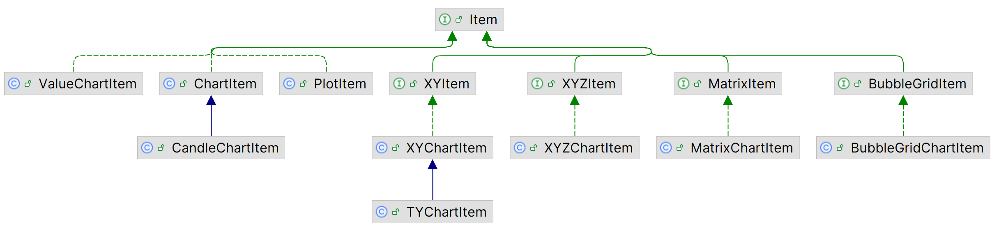
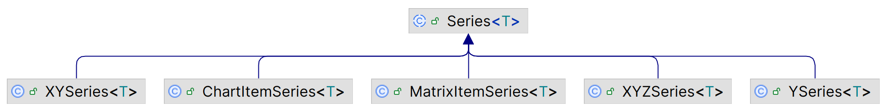

# 数据

## 数据点

`Item` 接口表示 chart 中的一个数据点。相关实现：

每个 item 包含 4 个基本信息：

1. 名称
2. 填充色（fill）
3. 边框色（stroke）
4. 符号（symbol）

### XYItem

`XYItem` 表示笛卡尔坐标系上的点，额外添加的 3 个属性：

1. x 坐标
2. y 坐标
3. tooltip

`XYChartItem` 为其默认实现。

## Series

属性：

- stoke

渲染该 series 采用的颜色。

- strokeWidth

渲染该 series 所用线段宽度。如果在 line-chart 中。

- visible

series 是否不可，不过不可见，就不渲染该 series 包含的数据。

- symbol

该 series 默认的 symbol。当 Item 的 symbol 为 `Symbol.NONE` 时，采用该默认值。